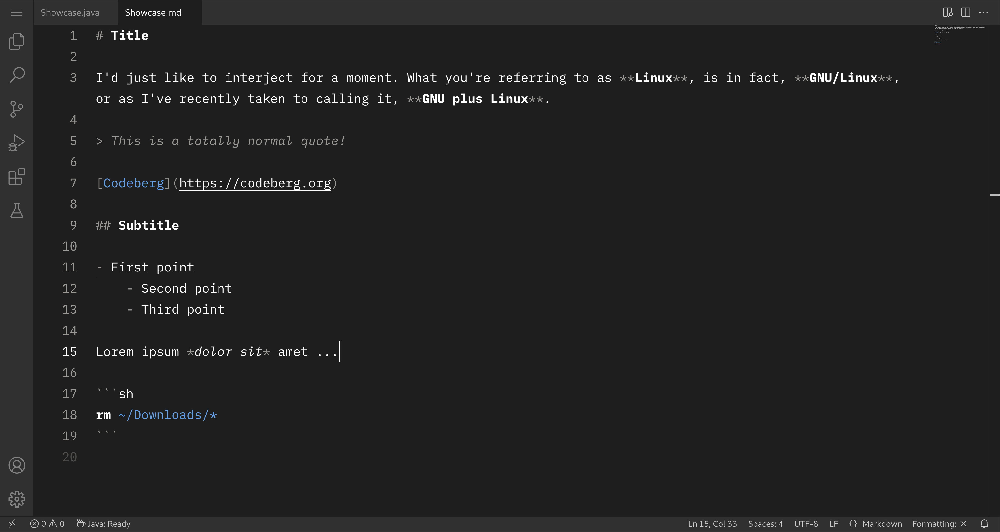
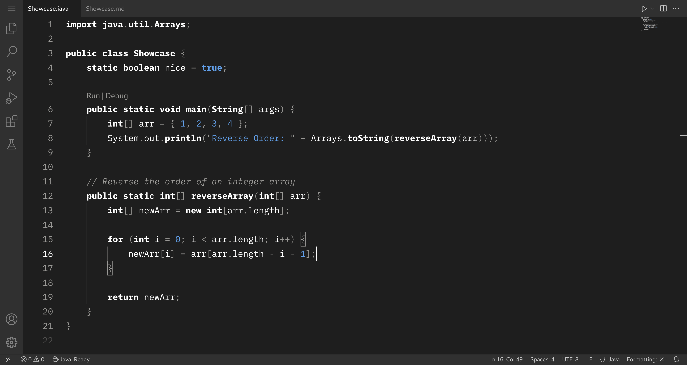
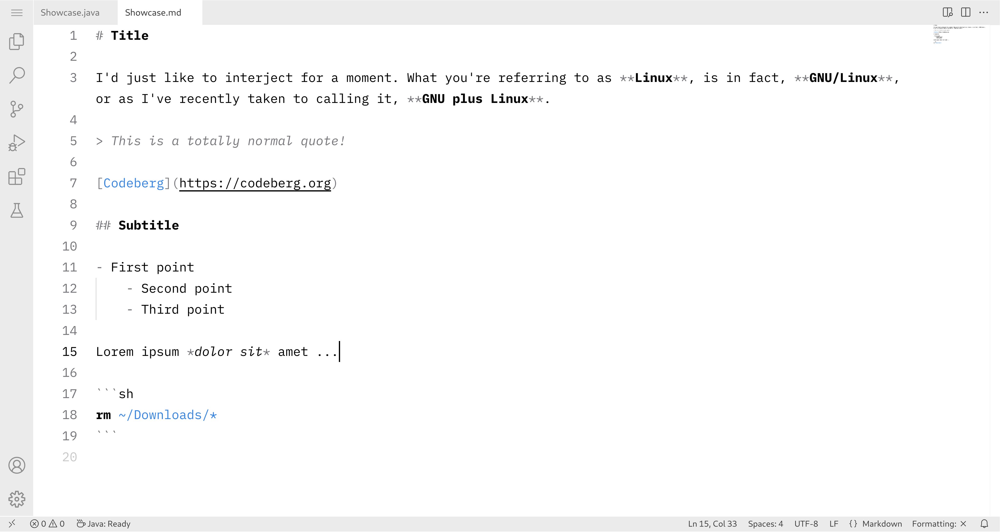
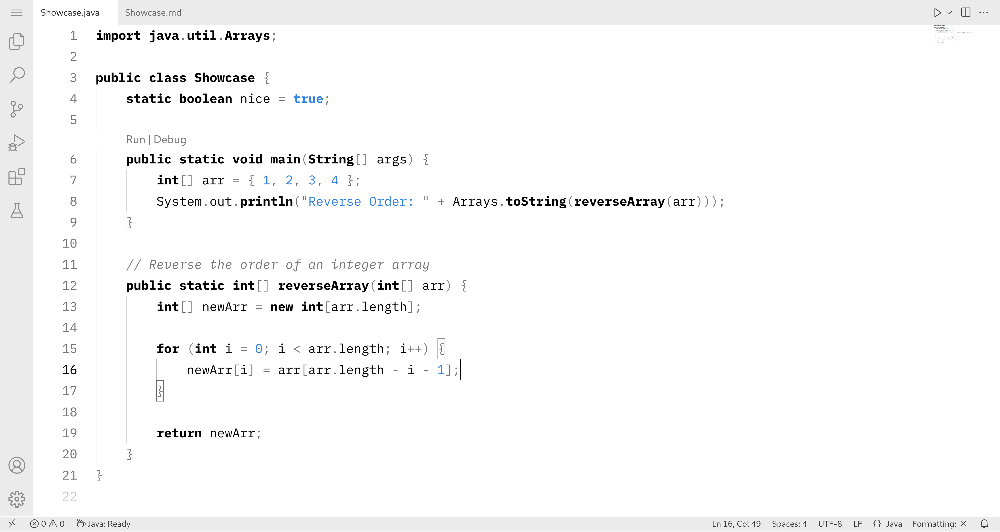

# Monochromator

A simple **monochrome** theme for **Visual Studio Code**.

If you also get a **headache** from the **color fiasco** of mainstream color schemes, then this extension is **just for you**. Too many **colors distract** you from **thinking clearly**.

That's why this theme uses only **black**, **white**, **gray** and the color **blue** (which highlights URLs, literals, etc.). The only exception to this rule are the colors for the Git decorations and errors / warnings, which also use red, orange and green. Additionally, if you are working under GNOME, this theme will fit very well into the overall desktop environment.

Following **two variants** are included:

### Monochromator Dark





### Monochromator Light





## Installation

Make sure that the **npm package** `vsce` is installed. If not, do the following:

```sh
npm install -g vsce
```

Clone the repository:

```sh
git clone https://codeberg.org/beem/monochromator.git
cd monochromator
```

Build the `.vsix` file:

```sh
vsce package
```

> [!NOTE]
> Depending on your Visual Studio Code installation, the command `code` could also be `code-insiders`, `codium` or `codium-insiders`.

Install the extension:

```sh
code --install-extension monochromator-*.vsix
```

## License

© 2025 Josias Beem

This project is licensed under the **MIT License** - see the `LICENSE` file for details.
